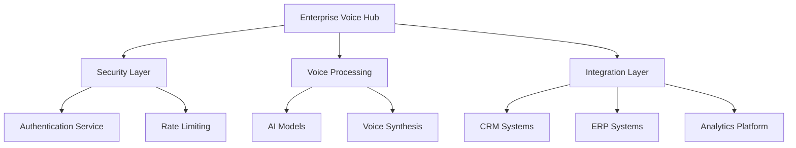
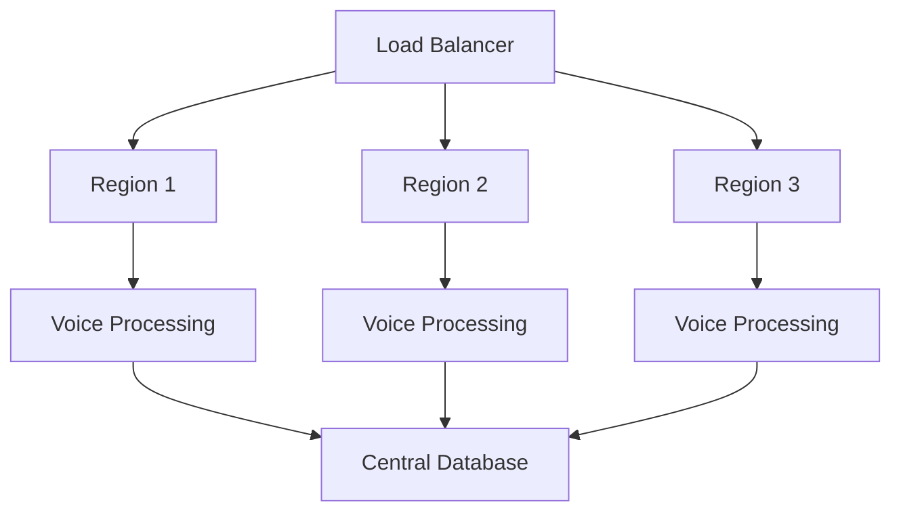

# Enterprise AI Voice Solutions

This document provides a comprehensive overview of enterprise-grade AI voice solutions, their implementation patterns, and best practices.

## Enterprise Solutions Overview

### 1. IBM Watsonx Assistant
- **URL**: ibm.com/watsonx
- **Key Features**:
  - Complex interaction handling
  - Enterprise-grade security
  - Multi-channel support
  - Advanced analytics
  - Custom model training
- **Use Cases**:
  - Enterprise customer service
  - Internal knowledge bases
  - Process automation
  - Multi-department integration
- **Implementation**:
  - Requires enterprise architecture
  - Custom integration patterns
  - Security compliance
  - Scalable deployment

### 2. NICE CXone
- **URL**: nice.com/cxone
- **Key Features**:
  - Cloud-based contact center
  - AI voice assistants
  - Workforce optimization
  - Quality management
  - Analytics and reporting
- **Use Cases**:
  - Large-scale contact centers
  - Customer experience management
  - Quality assurance
  - Performance analytics
- **Specialization**:
  - Contact center focus
  - Enterprise scalability
  - Compliance management

### 3. AI Rudder
- **URL**: airudder.com
- **Key Features**:
  - High-quality voice automation
  - Call center optimization
  - Customer engagement tools
  - Performance analytics
  - Multi-language support
- **Use Cases**:
  - Call center automation
  - Customer engagement
  - Sales optimization
  - Quality monitoring
- **Implementation**:
  - Enterprise integration
  - Custom workflows
  - Performance tracking
  - Quality assurance

## Enterprise Architecture Patterns

### 1. Centralized Voice Hub


### 2. Distributed Processing


## Security Considerations

### 1. Data Protection
- End-to-end encryption
- Secure key management
- Data residency compliance
- Access control policies
- Audit logging

### 2. Compliance Requirements
- GDPR compliance
- HIPAA compliance
- PCI DSS requirements
- Industry-specific regulations
- Data retention policies

### 3. Authentication and Authorization
- Multi-factor authentication
- Role-based access control
- API key management
- Session management
- Token-based authentication

## Implementation Guide

### Enterprise Integration Example
```python
from ibm_watson import AssistantV2
from ibm_cloud_sdk_core.authenticators import IAMAuthenticator

class EnterpriseVoiceAssistant:
    def __init__(self, api_key, service_url):
        authenticator = IAMAuthenticator(api_key)
        self.assistant = AssistantV2(
            version='2021-11-27',
            authenticator=authenticator
        )
        self.assistant.set_service_url(service_url)
    
    async def process_voice_input(self, audio_data, session_id):
        try:
            # Convert audio to text
            text_response = await self.assistant.message(
                assistant_id='YOUR_ASSISTANT_ID',
                session_id=session_id,
                input={
                    'message_type': 'text',
                    'text': audio_data
                }
            ).get_result()
            
            # Process response
            return self._handle_response(text_response)
        except Exception as e:
            self._log_error(e)
            return self._get_fallback_response()

    def _handle_response(self, response):
        # Implement response handling logic
        pass

    def _log_error(self, error):
        # Implement error logging
        pass

    def _get_fallback_response(self):
        # Implement fallback logic
        pass
```

## Best Practices

### 1. Architecture
- Implement microservices architecture
- Use containerization
- Implement service mesh
- Design for high availability
- Plan for disaster recovery

### 2. Performance
- Implement caching strategies
- Use CDN for voice delivery
- Optimize network latency
- Monitor system performance
- Implement auto-scaling

### 3. Monitoring
- Implement comprehensive logging
- Set up alerting systems
- Monitor API usage
- Track performance metrics
- Analyze user behavior

### 4. Maintenance
- Regular security updates
- Performance optimization
- Capacity planning
- Backup strategies
- Documentation updates

## Common Enterprise Use Cases

### 1. Customer Service
- 24/7 support automation
- Multi-language support
- Quality monitoring
- Performance analytics
- Customer satisfaction tracking

### 2. Internal Operations
- Employee training
- Process automation
- Knowledge management
- Internal communications
- Quality assurance

### 3. Sales and Marketing
- Lead qualification
- Product information
- Campaign management
- Customer engagement
- Performance tracking

### 4. Compliance and Security
- Regulatory compliance
- Data protection
- Access control
- Audit trails
- Security monitoring

## Resources

- [IBM Watsonx Documentation](https://www.ibm.com/docs/en/watsonx)
- [NICE CXone Developer Portal](https://developer.nice.com)
- [AI Rudder API Reference](https://docs.airudder.com)
- [Enterprise Architecture Patterns](https://martinfowler.com/patterns/)
- [Security Best Practices](https://owasp.org/www-project-top-ten/) 